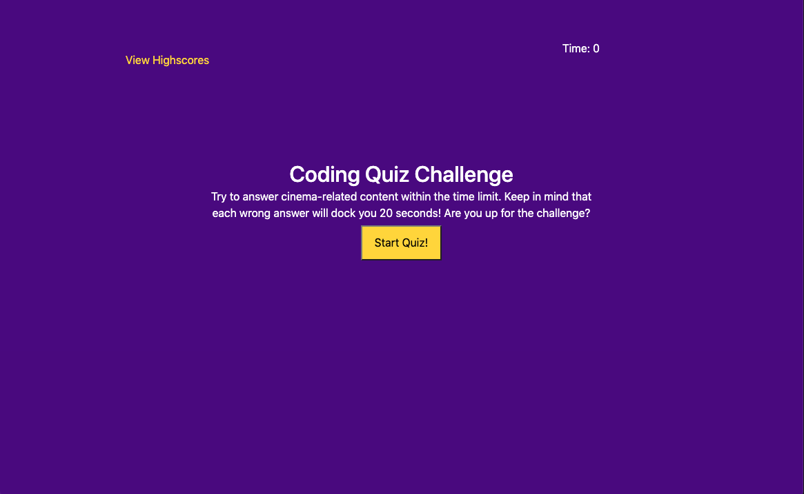
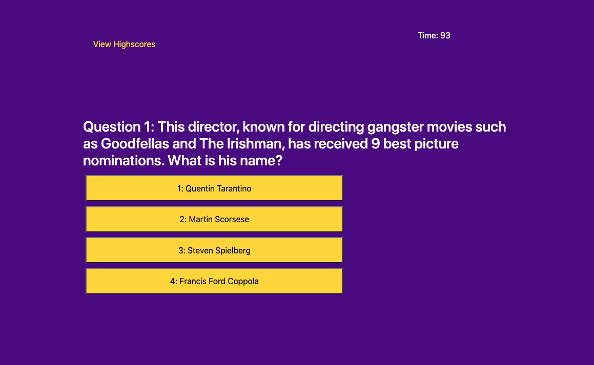
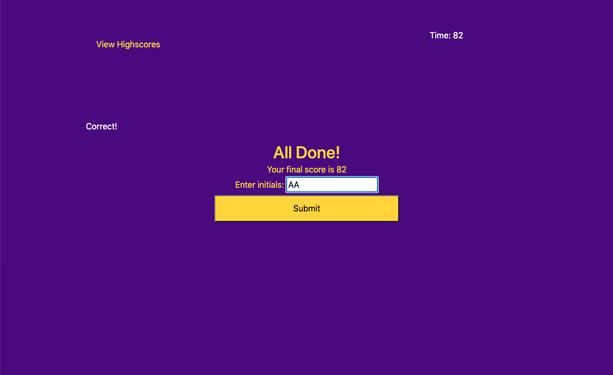
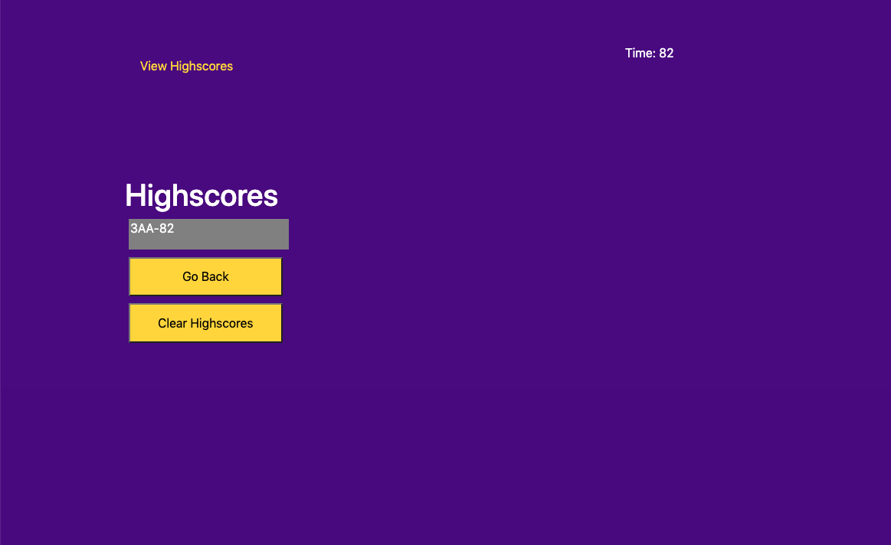

# Quiz_Challenge

## What , Why, and How
With this assignment, I was motivated to use a combination of JavaScript and DOM manipulation in order to dynamically change the display of a webpage based on user input. It was difficult, but for the most part I got it done. HOWEVER, I'm still stuck on how to keep a running log of the highscores. Right now, that is the only part of my webpage that isn't working. I will continue to try to fix this, even as the assignment due date has passed. I will review Activities that are relevant, search on Google, and seek help from my tutor if I still find myself unable to complete this last part. 
In order to do this assignment, I:
1. Created a start page, which told teh user what the quiz was about and gave them the option to start the quiz by licking on a button
2. Let the user advance each time they clicked a right answer
3. Each time the user clicked a wrong answer, I kept them on the same page and docked 20 seconds from the timer
4. Upon successfuly answering the final question, or upon the timer being reduced to zero, I sent the user to the End Page, where they are able to see their score and enter their initials 
5. Upon submitting their initials, I attempted to log the results to a scoreboard. I failed with this task. Currently the scoreboard in nonsensical, and the local storage is only storing the initials, not the scores. To fix this, I must change the content of the scoreboard so that it has a ranking and a score associated with each of the initials, and I must store the ranking and score in local storage. 

I've only been coding for two and a half weeks, but in that time I've discovered that coding can both be extremely frustrating and extremely rewarding. Right now it's very frustrating. I feel lost, and I don't know how I'm supposed to intuitively know the answer to this given the content that has been taught in the class. I will continue to gather knowledge until the answer feels intuitive and is successful.

# Links
Link to Quiz Challenge: https://andrew1835.github.io/Quiz_Challenge/
Link to GitHub Repository: https://github.com/andrew1835/Quiz_Challenge

# Screenshots

